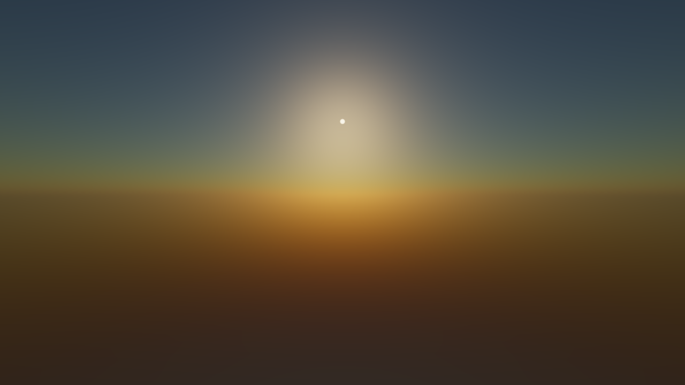
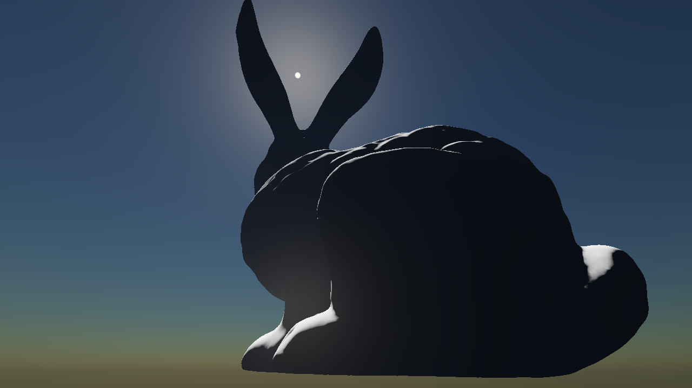

# Production Ready Atmosphere Rendering

An atmospheric scattering implementation based on a paper with the the same name, written by Sébastien Hillaire.

This Gigi render technique implements the entire pipeline described in "A Scalable and Production Ready Sky and Atmosphere Rendering Technique":
- Precomputed atmospheric transmittance based on "Precomputed Atmospheric Scattering" by Bruneton and Neyret.
- Precomputed multiple scattering LUT for atmosphere.
- Sky view LUT from surface.
- Aerial perspective LUT for camera frustum, without visibility term.
- ACES filmic tonemapping of output color target.

The Gigi technique exposes the Aerial Perspective LUT and a color target containing the rendered sky.
These can be used by other techniques to shade geometry using atmospheric scattering.

A tonemapped version of the color target is also provided to preview the skybox output.

## Rendering with the Aerial Perspective LUT

The Aerial Perspective LUT can be sampled on a per-vertex basis for objects, or during the lighting pass when rendering using a deferred renderer. Since visibility is not used in the LUT some artifacts remain. Nevertheless, the result looks awesome :)

## License

This is an open-source implementation of the original paper under the MIT license. This implementation does not use any code of the original work.
